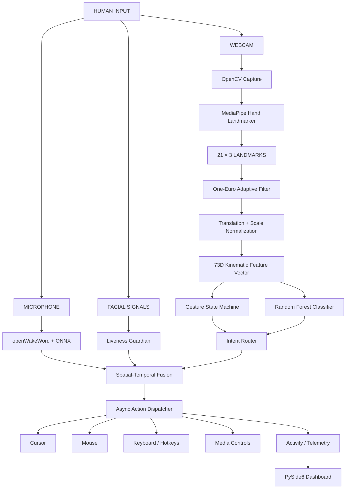

# ⚡ NEXUS

### Adaptive Touchless Interaction & Intelligent Gesture Control System

<p align="center">
  <strong>PERCEPTION → FEATURE ENGINEERING → INTELLIGENCE → FUSION → DECISION → ACTUATION</strong>
</p>

<p align="center">
  
  
  
  
  
</p>

<p align="center">
  
  
  
  
</p>

---

## 🧠 SYSTEM OVERVIEW

**NEXUS** is a real-time multimodal Human–Machine Interaction platform that converts **hand motion, voice context, and liveness signals** into operating-system actions.

Rather than treating gesture recognition as a simple:

```text
Camera → Gesture → Action
```

pipeline, NEXUS is designed as a complete intelligent control loop:

```text
                         ┌──────────────────┐
                         │      HUMAN       │
                         └────────┬─────────┘
                                  │
                    ┌─────────────┼─────────────┐
                    │             │             │
                    ▼             ▼             ▼
                 HAND           VOICE         FACE
                MOTION          INTENT       LIVENESS
                    │             │             │
                    └─────────────┼─────────────┘
                                  ▼
                         ┌──────────────────┐
                         │    PERCEPTION    │
                         │ MediaPipe/OpenCV │
                         └────────┬─────────┘
                                  │
                                  ▼
                         ┌──────────────────┐
                         │ SIGNAL PROCESSING│
                         │   One-Euro DSP   │
                         └────────┬─────────┘
                                  │
                                  ▼
                         ┌──────────────────┐
                         │ FEATURE ENGINE   │
                         │     73-D Φ       │
                         └────────┬─────────┘
                                  │
                         ┌────────┴────────┐
                         ▼                 ▼
                 ┌──────────────┐  ┌──────────────┐
                 │ STATE        │  │ RANDOM       │
                 │ MACHINE      │  │ FOREST       │
                 └──────┬───────┘  └──────┬───────┘
                        │                 │
                        └────────┬────────┘
                                 ▼
                       ┌────────────────────┐
                       │ MULTIMODAL FUSION  │
                       │ Spatial + Temporal │
                       └─────────┬──────────┘
                                 │
                                 ▼
                       ┌────────────────────┐
                       │  INTENT / DECISION │
                       └─────────┬──────────┘
                                 │
                                 ▼
                       ┌────────────────────┐
                       │ ACTION DISPATCHER  │
                       └─────────┬──────────┘
                                 │
                 ┌───────────────┼───────────────┐
                 ▼               ▼               ▼
              CURSOR           MOUSE          KEYBOARD
                 │               │               │
                 └───────────────┼───────────────┘
                                 ▼
                           ┌───────────┐
                           │    OS     │
                           └───────────┘
```

---

# 🔬 ENGINEERING MODEL

NEXUS combines multiple engineering disciplines:

```text
             NEXUS ENGINEERING STACK

                  HUMAN INPUT
                       │
                       ▼
              ┌────────────────┐
              │ COMPUTER VISION│
              └───────┬────────┘
                      │
                      ▼
              ┌────────────────┐
              │ SIGNAL         │
              │ PROCESSING     │
              └───────┬────────┘
                      │
                      ▼
              ┌────────────────┐
              │ FEATURE        │
              │ ENGINEERING    │
              └───────┬────────┘
                      │
                      ▼
              ┌────────────────┐
              │ MACHINE        │
              │ LEARNING       │
              └───────┬────────┘
                      │
                      ▼
              ┌────────────────┐
              │ MULTIMODAL     │
              │ FUSION         │
              └───────┬────────┘
                      │
                      ▼
              ┌────────────────┐
              │ DECISION       │
              │ SYSTEM         │
              └───────┬────────┘
                      │
                      ▼
              ┌────────────────┐
              │ CONTROL / OS   │
              │ ACTUATION      │
              └────────────────┘
```

This makes NEXUS a practical intersection of:

**AI × Computer Vision × Machine Learning × Robotics Concepts × Data Engineering × HCI × Real-Time Systems**

---

# 🏗️ ARCHITECTURE



---

# 📐 73-D KINEMATIC FEATURE SPACE

NEXUS does not feed raw hand coordinates directly into the classifier.

MediaPipe produces:

```text
21 landmarks × 3 coordinates

= 63 spatial values
```

These are transformed into a normalized geometric representation.

## 1. Translation Invariance

The wrist is used as the coordinate origin:

$$
P'_i = P_i - P_0
$$

This removes the absolute position of the hand within the camera frame.

---

## 2. Anatomical Scale Normalization

The wrist-to-middle-MCP distance becomes the reference scale:

$$
L_{palm} = \|P'_9\|_2
$$

Each landmark is normalized:

$$
v_i =
\frac{P'_i}
{\max(L_{palm},10^{-6})}
$$

This reduces sensitivity to:

* Camera distance
* Hand size
* Spatial position
* Frame scale

---

## 3. Fingertip Geometry

The five fingertips are:

```text
Thumb    → P4
Index    → P8
Middle   → P12
Ring     → P16
Pinky    → P20
```

Pairwise distances:

$$
D_{i,j} = \|v_i-v_j\|_2
$$

The number of unique fingertip pairs is:

$$
\binom{5}{2}=10
$$

Therefore:

```text
63 normalized coordinate features
+
10 fingertip geometric features
--------------------------------
73 total features
```

Final representation:

$$
\Phi \in \mathbb{R}^{73}
$$

---

# ⚙️ ADAPTIVE SIGNAL PROCESSING

Hand tracking contains natural micro-jitter and landmark estimation noise.

NEXUS uses a **One-Euro adaptive filter** to dynamically balance smoothness and responsiveness.

Adaptive cutoff:

$$
f_c =
f_{c,min}
+
\beta |\dot{\hat{x}}_k|
$$

Filter coefficient:

$$
\alpha =
\frac{2\pi f_c T_e}
{2\pi f_c T_e + 1}
$$

Recursive filtering:

$$
\hat{x}_k =
\alpha x_k
+
(1-\alpha)\hat{x}_{k-1}
$$

Current design parameters:

| Parameter      |    Value |
| -------------- | -------: |
| Minimum cutoff | `0.8 Hz` |
| Beta           |    `0.4` |

### Behavioral model

```text
STATIONARY HAND
      │
      ▼
LOW VELOCITY
      │
      ▼
MORE SMOOTHING
      │
      ▼
JITTER SUPPRESSION


FAST MOVEMENT
      │
      ▼
HIGH VELOCITY
      │
      ▼
HIGHER CUTOFF
      │
      ▼
LOWER PERCEIVED LAG
```

---

# 🌲 MACHINE LEARNING ENGINE

NEXUS supports user-defined gesture learning through a Random Forest classifier.

```text
┌────────────────────┐
│   RECORD GESTURE   │
└─────────┬──────────┘
          ▼
┌────────────────────┐
│ LANDMARK SEQUENCE  │
└─────────┬──────────┘
          ▼
┌────────────────────┐
│ 73D FEATURE        │
│ EXTRACTION         │
└─────────┬──────────┘
          ▼
┌────────────────────┐
│ TRAINING DATASET   │
└─────────┬──────────┘
          ▼
┌────────────────────┐
│ RANDOM FOREST      │
└─────────┬──────────┘
          ▼
┌────────────────────┐
│ STRATIFIED 3-FOLD  │
│ CROSS VALIDATION   │
└─────────┬──────────┘
          ▼
┌────────────────────┐
│ MODEL DEPLOYMENT   │
└────────────────────┘
```

### Model Configuration

| Parameter      |        Configuration |
| -------------- | -------------------: |
| Algorithm      |        Random Forest |
| Estimators     |                   50 |
| Maximum Depth  |                   10 |
| Input Features |                   73 |
| Validation     | 3-Fold Stratified CV |

---

# ✋ BUILT-IN GESTURE ENGINE

| Gesture         | Landmark Logic                            | Result                     |
| --------------- | ----------------------------------------- | -------------------------- |
| Cursor Tracking | Index fingertip `P8`                      | Cursor movement            |
| Left Click      | `P4 ↔ P8 < 0.045`                         | Left click                 |
| Drag            | Pinch held `≥ 0.5 s`                      | Drag                       |
| Right Click     | `P4 ↔ P12 < 0.045`                        | Right click                |
| Scroll          | `P4 ↔ P20 < 0.05` + vertical displacement | Scroll                     |
| Precision Mode  | Left-hand pinch                           | Reduced cursor sensitivity |
| Custom Gesture  | 73D ML representation                     | User-defined action        |

---

# 🎙️ VOICE INTELLIGENCE

NEXUS adds voice as a second interaction channel.

```text
MICROPHONE
     │
     ▼
AUDIO STREAM
     │
     ▼
OPENWAKEWORD
     │
     ▼
"HEY JARVIS"
     │
     ▼
VOICE CONTEXT
     │
     ▼
SPATIAL-TEMPORAL FUSION
```

The voice subsystem uses:

```text
openWakeWord
        +
ONNX Runtime
        +
Local inference
```

---

# 🔀 MULTIMODAL FUSION

NEXUS can combine voice intent with spatial hand context.

Example:

```text
User:

"Hey Jarvis, click here."
```

The system can reason across:

```text
VOICE INTENT
     +
HAND POSITION
     +
GESTURE STATE
     +
TEMPORAL CONTEXT
```

Conceptually:

```text
              VOICE
                │
                ▼
        ┌───────────────┐
        │               │
HAND ──►│     FUSION    │◄── TEMPORAL CONTEXT
        │               │
        └───────┬───────┘
                │
                ▼
             INTENT
                │
                ▼
             ACTION
```

This transforms NEXUS from a gesture detector into a **multimodal interaction engine**.

---

# 🛡️ LIVENESS GUARDIAN

NEXUS includes a liveness validation layer.

Signals include:

```text
Facial micro-motion
        │
        ├──────►
        │
Blink detection
        │
        ├──────► LIVENESS GUARDIAN
        │
Voice energy variance
        │
        └──────►
```

The resulting liveness state can participate in the interaction decision pipeline before OS actuation.

---

# ⚡ REAL-TIME PIPELINE

The current project documentation reports an end-to-end target profile of approximately:

```text
65+ FPS
≈ 15.4 ms
```

The documented stage profile is:

| Pipeline Stage     | Algorithm                 | Approx. Latency |
| ------------------ | ------------------------- | --------------: |
| Frame Capture      | Threaded OpenCV           |          1.2 ms |
| Landmark Detection | MediaPipe Hand Landmarker |         11.5 ms |
| DSP Filter         | One-Euro                  |         0.08 ms |
| Feature Extraction | 73D Kinematics            |         0.22 ms |
| ML Inference       | Random Forest             |         0.45 ms |
| OS Actuation       | Async Dispatcher          |         0.15 ms |
| GUI Render         | PySide6                   |          1.8 ms |
| **End-to-End**     | **Full pipeline**         |    **~15.4 ms** |

> These are the project's documented benchmark figures; benchmark results can vary with hardware, camera, OS, and runtime configuration.

---

# 🧵 CONCURRENCY MODEL

NEXUS separates major workloads to keep interaction responsive.

```text
                         APPLICATION
                              │
          ┌───────────────────┼───────────────────┐
          │                   │                   │
          ▼                   ▼                   ▼
   CAMERA THREAD       VOICE THREAD          UI THREAD
          │                   │                   │
          ▼                   ▼                   │
     PERCEPTION          WAKE WORD               │
          │                   │                   │
          └──────────┬────────┘                   │
                     ▼                            │
                  FUSION                          │
                     │                            │
                     ▼                            │
             ACTION DISPATCHER ◄─────────────────┘
                     │
                     ▼
                    OS
```

The action dispatcher is designed to prioritize current interaction state rather than allowing stale cursor commands to accumulate.

---

# 📊 DATA ENGINEERING VIEW

The NEXUS runtime can be understood as a real-time streaming data pipeline:

```text
┌──────────────────┐
│ SENSOR INGESTION │
└────────┬─────────┘
         ▼
┌──────────────────┐
│ RAW OBSERVATION  │
│ VIDEO / AUDIO    │
└────────┬─────────┘
         ▼
┌──────────────────┐
│ TRANSFORMATION   │
│ LANDMARKS        │
└────────┬─────────┘
         ▼
┌──────────────────┐
│ FEATURE STORE    │
│ 73D KINEMATICS   │
└────────┬─────────┘
         ▼
┌──────────────────┐
│ ML INFERENCE     │
└────────┬─────────┘
         ▼
┌──────────────────┐
│ EVENT / INTENT   │
└────────┬─────────┘
         ▼
┌──────────────────┐
│ ACTION STREAM    │
└────────┬─────────┘
         ▼
┌──────────────────┐
│ OS ACTUATION     │
└────────┬─────────┘
         ▼
┌──────────────────┐
│ OBSERVABILITY    │
└──────────────────┘
```

This architecture introduces concepts from:

* Streaming data systems
* Edge computing
* Event-driven architecture
* Real-time analytics
* Feature engineering
* ML inference pipelines

---

# 🖥️ NEXUS DASHBOARD

The PySide6 dashboard provides an operational control surface for the system.

### Live View

```text
┌──────────────────────────────────────────────┐
│ NEXUS / LIVE PERCEPTION                      │
├──────────────────────────────────────────────┤
│                                              │
│              CAMERA STREAM                   │
│                                              │
│          ●──●──●──●──●                       │
│             HAND MESH                        │
│                                              │
├──────────────────────────────────────────────┤
│ FPS       : 65+                              │
│ Gesture   : MOVE                             │
│ Filter    : ACTIVE                           │
│ Liveness  : VERIFIED                         │
│ System    : ONLINE                           │
└──────────────────────────────────────────────┘
```

The dashboard contains:

```text
LIVE VIEW
TRAINER
BINDINGS
ACTIVITY LOG
SETTINGS
```

---

# 🧩 REPOSITORY ARCHITECTURE

The repository currently organizes the application under `files/`.

```text
ASIS-adaptive-screen-interaction-sysytem-NEXUS/
│
├── README.md
├── .gitignore
│
└── files/
    │
    ├── main.py
    ├── config.py
    ├── capture.py
    ├── filters.py
    ├── actions.py
    ├── gestures.py
    ├── trainer.py
    ├── voice.py
    ├── fusion.py
    ├── liveness.py
    ├── recorder.py
    │
    ├── requirements.txt
    ├── NEXUS.spec
    │
    └── ui/
        └── dashboard.py
```

### Module Responsibilities

| Module         | Responsibility                                  |
| -------------- | ----------------------------------------------- |
| `main.py`      | Application entry point / runtime orchestration |
| `config.py`    | Hyperparameters and persistent configuration    |
| `capture.py`   | Non-blocking camera capture                     |
| `filters.py`   | One-Euro adaptive filtering                     |
| `actions.py`   | Asynchronous OS action dispatch                 |
| `gestures.py`  | Gesture state machine and ML routing            |
| `trainer.py`   | 73D feature extraction and model training       |
| `voice.py`     | Local wake-word inference                       |
| `fusion.py`    | Spatial-temporal gesture/voice fusion           |
| `liveness.py`  | Liveness validation                             |
| `recorder.py`  | Gesture dataset collection                      |
| `dashboard.py` | PySide6 graphical interface                     |

---

# 🚀 INSTALLATION

## 1. Clone

```bash
git clone https://github.com/SaketharamaBana/ASIS-adaptive-screen-interaction-sysytem-NEXUS.git

cd ASIS-adaptive-screen-interaction-sysytem-NEXUS
```

## 2. Create Virtual Environment

### Windows

```bash
python -m venv .venv
```

Activate:

```bash
.venv\Scripts\activate
```

### Linux / macOS

```bash
python3 -m venv .venv
```

Activate:

```bash
source .venv/bin/activate
```

## 3. Install Dependencies

The Python application and dependency manifest are located under `files/`.

```bash
cd files

pip install -r requirements.txt
```

---

# ▶️ RUN NEXUS

From the `files/` directory:

### GUI Mode

```bash
python main.py
```

### CLI / OpenCV Mode

```bash
python main.py --cli
```

---

# 🧪 CUSTOM GESTURE TRAINING

```text
             CREATE LABEL
                  │
                  ▼
             RECORD SAMPLES
                  │
                  ▼
           CAPTURE LANDMARKS
                  │
                  ▼
            EXTRACT 73D Φ
                  │
                  ▼
            TRAIN RANDOM
               FOREST
                  │
                  ▼
          STRATIFIED 3-FOLD
             VALIDATION
                  │
                  ▼
             SAVE MODEL
                  │
                  ▼
           BIND ACTION
                  │
                  ▼
          CONTROL THE OS
```

Example custom gestures:

```text
wave
peace_sign
thumbs_up
custom_pose
```

The dashboard's Trainer and Bindings workflow is designed to connect learned gestures to actions such as media controls, screenshots, desktop switching, window switching, and custom hotkeys.

---

# 🎯 DESIGN PRINCIPLES

### 01 — Perception ≠ Decision

Vision detects observations.

The decision layer determines intent.

---

### 02 — Geometry Matters

Gestures are represented through spatial relationships rather than relying exclusively on raw image pixels.

---

### 03 — Fresh State > Stale Commands

Real-time interaction should prioritize current user intent.

---

### 04 — Multimodal Context

Human intent can be expressed through:

```text
Gesture
+
Voice
+
Position
+
Time
+
Liveness
```

---

### 05 — Modular Intelligence

Each major subsystem remains independently extensible:

```text
Vision
ML
DSP
Voice
Fusion
Liveness
Control
UI
```

---

# 📈 ENGINEERING METRICS

```text
╔══════════════════════════════════════════════╗
║              NEXUS ENGINEERING              ║
╠══════════════════════════════════════════════╣
║                                              ║
║  21       Hand Landmarks                    ║
║  63       Normalized Coordinates            ║
║  10       Fingertip Distances               ║
║  73       Total Feature Dimensions          ║
║                                              ║
║  50       Random Forest Estimators          ║
║  10       Maximum Tree Depth                ║
║  3        Cross-Validation Folds            ║
║                                              ║
║  0.8 Hz   Minimum Filter Cutoff             ║
║  0.4      Adaptive Filter Beta              ║
║  0.5 s    Drag Hold Threshold               ║
║  65%      Precision Sensitivity Reduction  ║
║                                              ║
║  65+ FPS  Documented Runtime Target        ║
║  ~15.4ms  Documented Pipeline Profile      ║
║                                              ║
╚══════════════════════════════════════════════╝
```

---

# 🔭 ROADMAP

## Perception

* [x] Hand landmark detection
* [x] Real-time camera capture
* [x] Landmark normalization
* [x] Adaptive signal filtering

## Machine Learning

* [x] 73D feature extraction
* [x] Gesture dataset recorder
* [x] Random Forest classifier
* [x] Cross-validation workflow

## Multimodal Intelligence

* [x] Wake-word detection
* [x] Voice subsystem
* [x] Spatial-temporal fusion
* [x] Liveness Guardian

## Desktop Control

* [x] Cursor movement
* [x] Mouse clicking
* [x] Drag and drop
* [x] Scrolling
* [x] Hotkeys
* [x] Media actions

## Future Research

* [ ] Temporal Transformer gesture models
* [ ] Gesture embeddings
* [ ] Continual learning
* [ ] Personalized calibration
* [ ] Multi-hand reasoning
* [ ] Context-aware intent prediction
* [ ] Model drift detection
* [ ] Dataset versioning
* [ ] Advanced interaction analytics
* [ ] Hardware acceleration
* [ ] Predictive gesture intent

---

# 🧠 FUTURE NEXUS

The long-term architecture is envisioned as a more general multimodal interaction platform:

```text
                     HUMAN
                       │
          ┌────────────┼────────────┐
          ▼            ▼            ▼
        VISION        VOICE        MOTION
          │            │            │
          └────────────┼────────────┘
                       ▼
               MULTIMODAL EMBEDDING
                       │
                       ▼
                TEMPORAL REASONING
                       │
                       ▼
                  CONTEXT ENGINE
                       │
                       ▼
                  INTENT MODEL
                       │
                       ▼
                 ACTION POLICY
                       │
                       ▼
              DIGITAL ENVIRONMENT
```

The ultimate direction is to move from:

```text
Gesture Recognition
```

toward:

```text
Human Intent Understanding
```

---

# 🏆 WHY NEXUS IS DIFFERENT

NEXUS is not just a webcam mouse.

It combines:

```text
┌────────────────────────────────────────────┐
│                                            │
│  COMPUTER VISION                           │
│          +                                 │
│  KINEMATIC FEATURE ENGINEERING             │
│          +                                 │
│  ADAPTIVE SIGNAL PROCESSING                │
│          +                                 │
│  MACHINE LEARNING                          │
│          +                                 │
│  VOICE INTELLIGENCE                        │
│          +                                 │
│  SPATIAL-TEMPORAL FUSION                   │
│          +                                 │
│  LIVENESS VALIDATION                       │
│          +                                 │
│  ASYNCHRONOUS CONTROL                      │
│          +                                 │
│  REAL-TIME OBSERVABILITY                   │
│                                            │
└────────────────────────────────────────────┘
```

The result is an architecture that connects **human perception, machine intelligence, and operating-system control** in a single real-time loop.

---

# 📜 LICENSE

NEXUS is distributed under the **MIT License**.

---

# 👤 AUTHOR

## Saketharama Bana

**NEXUS — Adaptive Touchless Interaction & Intelligent Gesture Control System**

Built at the intersection of:

**AI · Computer Vision · Machine Learning · Robotics · Data Engineering · Signal Processing · Human-Computer Interaction**

---

<p align="center">

```text
━━━━━━━━━━━━━━━━━━━━━━━━━━━━━━━━━━━━━━━━━━━━━━

                 PERCEIVE
                    ↓
                UNDERSTAND
                    ↓
                  FUSE
                    ↓
                 DECIDE
                    ↓
                  ACT

━━━━━━━━━━━━━━━━━━━━━━━━━━━━━━━━━━━━━━━━━━━━━━
```

### NEXUS

**The interface between human intent and digital action.**

</p>
