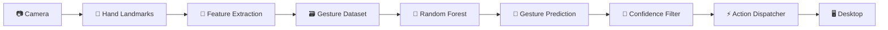
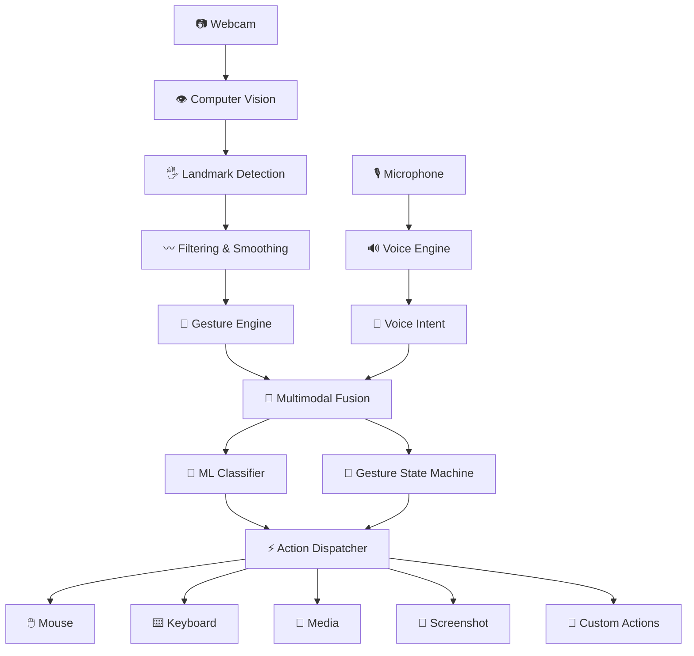

# 🧠 ASIS(NEXUS)

### Adaptive Touchless Interaction & Intelligent Gesture Control System

<p align="center">


</p>

<p align="center">

<strong>Control your computer with your hands.</strong><br/> <em>See. Understand. Decide. Execute.</em>

</p>

<p align="center">

<a href="#-quick-start">🚀 Quick Start</a> • <a href="#-features">✨ Features</a> • <a href="#-architecture">🏗️ Architecture</a> • <a href="#-ai-engine">🧠 AI Engine</a> • <a href="#-roadmap">🗺️ Roadmap</a>

</p>

---

## 🌌 Experience NEXUS

> **NEXUS transforms ordinary webcams and microphones into an intelligent, touchless desktop interface.**

Instead of physically touching a mouse or keyboard, users can interact with their computer using:

**👋 Hand gestures**

**🎙️ Voice commands**

**🧠 AI-powered custom gestures**

**⚡ Real-time desktop automation**

NEXUS combines **Computer Vision + Machine Learning + Human-Computer Interaction + Desktop Automation** into a single modular platform.

---

## 🎬 NEXUS in Action

<p align="center">

<!-- Replace this image with your actual demo GIF -->


</p>

<p align="center">
<em>Real-time gesture recognition → intent detection → desktop action</em>
</p>

> 💡 **Tip:** Add a recorded `nexus-demo.gif` under `assets/demo/` to turn this section into an animated product showcase.

---

# ⚡ The NEXUS Experience

```text
                    ┌───────────────────┐
                    │      HUMAN        │
                    │       👋 🎙️       │
                    └─────────┬─────────┘
                              │
                              ▼
                  ┌─────────────────────┐
                  │     PERCEPTION      │
                  │   👁️ Vision + Voice │
                  └──────────┬──────────┘
                             │
                             ▼
                  ┌─────────────────────┐
                  │    INTELLIGENCE     │
                  │ 🧠 Gesture + AI     │
                  └──────────┬──────────┘
                             │
                             ▼
                  ┌─────────────────────┐
                  │       FUSION        │
                  │   Context + State   │
                  └──────────┬──────────┘
                             │
                             ▼
                  ┌─────────────────────┐
                  │  ACTION DISPATCHER  │
                  │   ⚡ Execute Intent  │
                  └──────────┬──────────┘
                             │
                             ▼
              ┌─────────────────────────────┐
              │       YOUR COMPUTER        │
              │ 🖱️  ⌨️  🎵  📸  🖥️        │
              └─────────────────────────────┘
```

---

# ✨ Features

<table>
<tr>

<td width="50%" valign="top">

### 👋 Real-Time Gesture Control

Control the desktop using natural hand movements.

* Cursor movement
* Left click
* Right click
* Drag
* Scroll
* Precision mode
* Custom gestures

</td>

<td width="50%" valign="top">

### 🧠 AI Gesture Recognition

Teach NEXUS your own gestures.

* Record samples
* Extract features
* Train ML model
* Predict gestures
* Configure actions

</td>

</tr>

<tr>

<td width="50%" valign="top">

### 🎙️ Voice Interaction

Optional offline wake-word detection.

* Local processing
* Voice activation
* Multimodal interaction
* Command routing

</td>

<td width="50%" valign="top">

### 🖥️ NEXUS Dashboard

Monitor and configure the system through a PySide6 interface.

* Live monitoring
* Configuration
* Gesture training
* System status
* Action bindings

</td>

</tr>

<tr>

<td width="50%" valign="top">

### ⚡ Desktop Automation

Convert recognized intent into real OS actions.

* Mouse
* Keyboard
* Media
* Screenshots
* Hotkeys
* Custom commands

</td>

<td width="50%" valign="top">

### 🛡️ Liveness Layer

Lightweight anti-spoofing signals help improve interaction reliability.

> Not intended to replace biometric authentication.

</td>

</tr>
</table>

---

# 🖐️ Gesture Control Center

<p align="center">

| Gesture | Meaning                | Action            |
| :-----: | ---------------------- | ----------------- |
|    ☝️   | Index movement         | 🖱️ Move cursor   |
|    🤏   | Thumb + Index          | 🖱️ Left click    |
|    🤏   | Thumb + Middle         | 🖱️ Right click   |
|    ✊    | Hold pinch             | 🖱️ Drag          |
|    🤏   | Thumb + Pinky          | 📜 Scroll         |
|    🤏   | Left-hand pinch        | 🎯 Precision mode |
|    🧠   | Custom trained gesture | ⚡ Custom action   |

</p>

---

# 🎯 Precision Interaction

Normal cursor movement:

```text
HAND
 ↓
FAST MOVEMENT
 ↓
CURSOR
```

Precision mode:

```text
HAND
 ↓
PINCH
 ↓
SENSITIVITY ↓
 ↓
CONTROL ↑
 ↓
ACCURACY ↑
```

Designed for interaction with:

* Small buttons
* Text selection
* Design applications
* Detailed UI elements
* Fine cursor positioning

---

# 🧠 AI Engine

NEXUS contains a local custom gesture-learning pipeline.



### Custom Gesture Lifecycle

```text
┌─────────────┐
│   RECORD    │
└──────┬──────┘
       ↓
┌─────────────┐
│   EXTRACT   │
│  FEATURES   │
└──────┬──────┘
       ↓
┌─────────────┐
│    TRAIN    │
│ RandomForest│
└──────┬──────┘
       ↓
┌─────────────┐
│   PREDICT   │
└──────┬──────┘
       ↓
┌─────────────┐
│    BIND     │
│    ACTION   │
└─────────────┘
```

---

# 🎙️ Voice + Vision

NEXUS is not limited to a single input source.

```text
                 ┌──────────────┐
                 │    HUMAN     │
                 └──────┬───────┘
                        │
            ┌───────────┴───────────┐
            │                       │
            ▼                       ▼
       👋 HAND INPUT          🎙️ VOICE INPUT
            │                       │
            ▼                       ▼
       COMPUTER VISION         WAKE WORD
            │                       │
            └───────────┬───────────┘
                        ▼
                 🧠 FUSION ENGINE
                        │
                        ▼
                  INTENT ENGINE
                        │
                        ▼
                ⚡ ACTION ROUTER
                        │
                        ▼
                    DESKTOP
```

This architecture allows future development toward context-aware multimodal interaction.

---

# 🏗️ System Architecture



---

# 🔬 Real-Time Processing Pipeline

NEXUS processes interaction signals through several stages.

```text
             CAMERA FRAME
                  │
                  ▼
        ┌───────────────────┐
        │ Frame Acquisition │
        └─────────┬─────────┘
                  ▼
        ┌───────────────────┐
        │ Hand Detection    │
        └─────────┬─────────┘
                  ▼
        ┌───────────────────┐
        │ Landmark Tracking │
        └─────────┬─────────┘
                  ▼
        ┌───────────────────┐
        │ Feature Extraction│
        └─────────┬─────────┘
                  ▼
        ┌───────────────────┐
        │ Filtering         │
        │ Smoothing         │
        └─────────┬─────────┘
                  ▼
        ┌───────────────────┐
        │ Gesture State     │
        └─────────┬─────────┘
                  ▼
        ┌───────────────────┐
        │ AI Classification │
        └─────────┬─────────┘
                  ▼
        ┌───────────────────┐
        │ Confidence Check  │
        └─────────┬─────────┘
                  ▼
        ┌───────────────────┐
        │ Action Dispatcher │
        └─────────┬─────────┘
                  ▼
             DESKTOP OS
```

---

# 🧩 Action System

All actions pass through a centralized dispatcher.

### Why?

Instead of:

```text
Gesture → Mouse
Gesture → Keyboard
Gesture → Media
```

NEXUS uses:

```text
                 GESTURE
                    │
                    ▼
              INTENT / ACTION
                    │
                    ▼
            ACTION DISPATCHER
             ╱      │      ╲
            ▼       ▼       ▼
         Mouse   Keyboard  Media
```

This makes the system easier to extend.

---

# ⚡ Built-In Actions

| Category     | Supported Operations       |
| ------------ | -------------------------- |
| 🖱️ Mouse    | Move, click, drag, scroll  |
| ⌨️ Keyboard  | Hotkeys, shortcuts         |
| 🎵 Media     | Play, pause, mute          |
| 📸 System    | Screenshot                 |
| 🎯 Precision | Reduced cursor sensitivity |
| 🧩 Custom    | User-defined actions       |

Example custom binding:

```text
Gesture: peace
        ↓
Action: screenshot
```

Another:

```text
Gesture: thumbs_up
        ↓
Action: media_play_pause
```

---

# 🖥️ NEXUS Dashboard

The PySide6 dashboard acts as the central control center.

```text
┌──────────────────────────────────────────────┐
│                  NEXUS                       │
├──────────────────────────────────────────────┤
│                                              │
│   ● SYSTEM ONLINE        FPS: 30            │
│                                              │
│   ┌──────────────────────────────────────┐   │
│   │                                      │   │
│   │          CAMERA PREVIEW              │   │
│   │                                      │   │
│   │             👋                       │   │
│   │                                      │   │
│   └──────────────────────────────────────┘   │
│                                              │
│   Gesture       : INDEX_MOVE                │
│   Confidence    : 94%                       │
│   Mode          : PRECISION                 │
│                                              │
├──────────────────────────────────────────────┤
│ Dashboard │ Gestures │ Trainer │ Settings   │
└──────────────────────────────────────────────┘
```

The dashboard is intended to provide:

* Live system status
* Camera monitoring
* Gesture state
* Confidence information
* Configuration
* Gesture training
* Action binding

---

# 🧪 Custom Gesture Studio

NEXUS can evolve with the user.

### 01 — Define

```text
Gesture Name
     ↓
"wave"
```

### 02 — Record

```text
Camera
  ↓
Samples
  ↓
Frames
```

### 03 — Train

```text
Dataset
  ↓
Feature Matrix
  ↓
Random Forest
```

### 04 — Bind

```text
Gesture
  ↓
Action
```

### 05 — Execute

```text
👋 Wave
   ↓
📸 Screenshot
```

---

# 🚀 Quick Start

## 1. Clone

```bash
git clone https://github.com/SaketharamaBana/ASIS-adaptive-screen-interaction-sysytem-NEXUS.git
```

```bash
cd ASIS-adaptive-screen-interaction-sysytem-NEXUS
```

---

## 2. Create Virtual Environment

### Windows

```powershell
python -m venv .venv
```

```powershell
.\.venv\Scripts\Activate.ps1
```

### macOS / Linux

```bash
python3 -m venv .venv
```

```bash
source .venv/bin/activate
```

---

## 3. Install Dependencies

```bash
cd files
```

```bash
python -m pip install --upgrade pip
```

```bash
python -m pip install -r requirements.txt
```

---

# ▶️ Run NEXUS

### 🖥️ Dashboard

```bash
python main.py
```

### 🐛 Debug / CLI

```bash
python main.py --cli
```

---

# 🎮 Controls

| Key | Action                        |
| --- | ----------------------------- |
| `q` | Exit NEXUS                    |
| `c` | Reset gesture/smoothing state |

---

# 📚 Custom Gesture Training

Record a gesture:

```bash
python recorder.py wave --samples 5 --frames 15
```

Train:

```bash
python trainer.py
```

Training data is stored locally in:

```text
gesture_data/
```

This directory should remain outside the main source repository.

---

# 📁 Project Structure

```text
ASIS-adaptive-screen-interaction-sysytem-NEXUS/
│
├── 📄 README.md
├── 📄 .gitignore
│
├── 📁 files/
│   │
│   ├── 🐍 main.py
│   ├── ⚙️ config.py
│   ├── 📷 capture.py
│   ├── 〰️ filters.py
│   ├── 👋 gestures.py
│   ├── ⚡ actions.py
│   ├── 🧠 fusion.py
│   ├── 🛡️ liveness.py
│   ├── 🎙️ voice.py
│   ├── 🧪 recorder.py
│   ├── 🌲 trainer.py
│   │
│   ├── 📦 requirements.txt
│   ├── 📦 NEXUS.spec
│   │
│   └── 📁 ui/
│       └── 🖥️ dashboard.py
│
└── 📁 assets/
    ├── 📁 demo/
    │   └── nexus-demo.gif
    ├── 📁 screenshots/
    └── 📁 architecture/
```

---

# 🧱 Module Architecture

| Module         | Responsibility                  |
| -------------- | ------------------------------- |
| `main.py`      | Application entry point         |
| `capture.py`   | Camera acquisition              |
| `filters.py`   | Smoothing and signal filtering  |
| `gestures.py`  | Gesture recognition/state logic |
| `actions.py`   | Desktop action dispatcher       |
| `fusion.py`    | Multimodal fusion               |
| `liveness.py`  | Liveness signals                |
| `voice.py`     | Voice/wake-word processing      |
| `recorder.py`  | Training data collection        |
| `trainer.py`   | ML model training               |
| `config.py`    | System configuration            |
| `dashboard.py` | PySide6 interface               |

---

# 🛠️ Technology Stack

<p align="center">

|    Technology    | Role                   |
| :--------------: | ---------------------- |
|     🐍 Python    | Core development       |
|    👁️ OpenCV    | Computer vision        |
|   🖐️ MediaPipe  | Hand tracking          |
|  🧠 scikit-learn | Machine learning       |
| 🌲 Random Forest | Gesture classification |
| 🎙️ openWakeWord | Wake-word detection    |
|    🖥️ PySide6   | Dashboard UI           |
|     🔢 NumPy     | Numerical processing   |
|  ⚡ Desktop APIs  | OS automation          |

</p>

---

# 🎯 Use Cases

### 🧑‍💻 Productivity

Hands-free desktop interaction.

### 📊 Presentations

Navigate presentations without touching the computer.

### ♿ Accessibility

Explore alternative input mechanisms.

### 🎨 Creative Work

Precision cursor interaction.

### 🧪 HCI Research

Experiment with gesture-based human-computer interaction.

### 🏠 Hands-Free Computing

Interact with applications when physical input is inconvenient.

---

# 🔐 Privacy & Security

NEXUS is designed primarily around local interaction processing.

Camera and microphone inputs are used when corresponding features are enabled.

However:

> ⚠️ NEXUS should **not** be considered a biometric authentication system.

The liveness layer is designed as an interaction reliability mechanism rather than a security boundary.

Do not use NEXUS as a replacement for:

* Password authentication
* MFA
* Enterprise identity systems
* Dedicated biometric authentication

---

# 🧯 Troubleshooting

### 📷 Camera not detected

Check:

```text
files/config.py
```

and verify the camera index.

---

### 🖱️ Cursor not responding

Check:

* Camera permissions
* Accessibility permissions
* OS input permissions
* Gesture detection
* Configuration

---

### 👋 Gesture recognition is unstable

Try:

* Better lighting
* Clearer hand visibility
* More training samples
* Adjusted smoothing
* Adjusted pinch thresholds
* Retraining the model

---

### 🎙️ Voice activation fails

Verify:

* Microphone permissions
* Correct microphone device
* Voice dependencies
* Wake-word configuration

---

# 📊 Performance

NEXUS is intended for real-time interaction.

The actual experience depends on:

```text
Camera FPS
      ↓
Detection Speed
      ↓
Feature Processing
      ↓
Classification
      ↓
Filtering
      ↓
Action Execution
```

Performance can vary based on:

* CPU/GPU
* Camera resolution
* FPS
* Lighting
* Number of tracked hands
* Background applications
* Operating system

---

# 🗺️ Roadmap

## ✅ Current

* [x] Real-time hand tracking
* [x] Cursor control
* [x] Left click
* [x] Right click
* [x] Drag
* [x] Scroll
* [x] Precision mode
* [x] Custom gesture recording
* [x] Random Forest classifier
* [x] Voice wake-word support
* [x] Action dispatcher
* [x] PySide6 dashboard
* [x] Liveness layer

## 🔄 In Development

* [ ] Advanced temporal gesture recognition
* [ ] Improved multimodal fusion
* [ ] Better gesture visualization
* [ ] User-specific calibration
* [ ] Gesture profiles
* [ ] Performance telemetry
* [ ] Expanded action library
* [ ] Cross-platform improvements

## 🔮 Future

* [ ] Context-aware gesture understanding
* [ ] Adaptive user models
* [ ] Advanced AI gesture models
* [ ] Plugin-based action architecture
* [ ] Gesture analytics
* [ ] Personalized interaction profiles
* [ ] Intelligent desktop agent integration

---

# 🌐 Project Vision

NEXUS is more than a gesture-control application.

The long-term vision is:

```text
             👁️ VISION
                +
             🎙️ VOICE
                +
             👋 GESTURE
                +
             🧠 AI
                +
            📍 CONTEXT
                +
          👤 PERSONALIZATION
                │
                ▼
       ┌──────────────────┐
       │      NEXUS       │
       │ Intelligent HCI  │
       └────────┬─────────┘
                │
                ▼
        Natural Computing
```

The objective is to move desktop interaction from:

> **"Tell the computer exactly what to do."**

toward:

> **"Interact naturally and let the system understand the intent."**

---

# 🧪 Research Areas

NEXUS provides a practical platform for experimentation in:

* Human-Computer Interaction
* Computer Vision
* Gesture Recognition
* Machine Learning
* Multimodal Interaction
* Accessibility
* Intelligent Interfaces
* Real-Time Systems
* Desktop Automation
* Applied AI

---

# 🤝 Contributing

Contributions are welcome.

```bash
git clone https://github.com/SaketharamaBana/ASIS-adaptive-screen-interaction-sysytem-NEXUS.git
```

Create a branch:

```bash
git checkout -b feature/my-feature
```

Make your changes, test them, and submit a pull request.

When contributing, keep:

* Perception modular
* Gesture logic independent
* Actions centralized
* Configuration separate
* New features documented

---

# ⭐ Support the Project

If NEXUS is useful or interesting:

⭐ Star the repository
🍴 Fork the project
🐛 Report issues
💡 Suggest improvements
🤝 Contribute

---

# 📜 License

NEXUS is distributed under the **MIT License**.

---

# 🔗 Repository

<p align="center">

<a href="https://github.com/SaketharamaBana/ASIS-adaptive-screen-interaction-sysytem-NEXUS">


</a>

</p>

<p align="center">

<strong>ASIS-adaptive-screen-interaction-sysytem-NEXUS</strong>

</p>

---

<p align="center">

### 👁️ See

### 🧠 Understand

### ⚡ Execute

### 🚀 NEXUS

</p>

<p align="center">
<em>Building the future of touchless human-computer interaction.</em>
</p>
